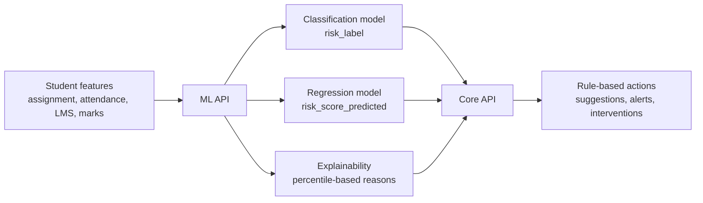

# AI Usage Statement

## 1) Purpose
This system uses machine learning to identify students at academic risk early and to prioritize support actions based on predicted risk.

## 2) Where AI is used
- **Model training (ML):** A supervised classification model predicts categorical risk labels (Low/Medium/High) and a regression model predicts a continuous risk score.
- **Model inference (ML):** The ML API loads the trained models and produces `risk_label`, `risk_label_id`, class probabilities, and `risk_score_predicted` for each request.
- **Explainability (data-driven):** The ML API generates `reasons` using dataset percentiles stored in metadata (e.g., low attendance below the 25th percentile, high risk score above the 75th percentile).

## 3) What is NOT AI
- **Intervention recommendations, alerts, and dashboards are rule-based.** They consume AI outputs but use deterministic logic.
- **Risk score calculation (fallback) is formula-based.** A weighted formula is used when a predicted score is unavailable.

## 4) Inputs and outputs
**Inputs (0-100 scale):** assignment, attendance, LMS activity, marks.

**Outputs:**
- risk_label (Low/Medium/High)
- risk_label_id
- class probabilities
- risk_score_predicted
- risk_score_calculated (formula-based fallback)
- reasons (top factors driving risk)
- suggestions (rule-based next steps)

## 5) AI flow (high-level)

## 6) Accountability and use
- AI outputs are **decision-support** signals and are meant to assist educators, not replace human judgment.
- Interventions remain **human-led**, with actions logged and tracked for improvement over time.
